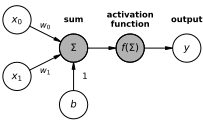
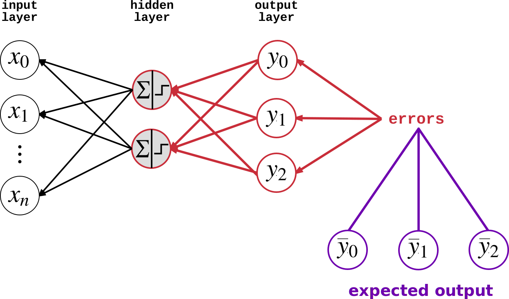
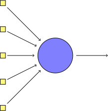

<h2>Deep Learning with Recurrent Neural Networks</h2>
<h4>In Python</h4>

    <a href="http://donaldwhyte.co.uk">Alejandro Saucedo</a>
    / <a href="http://twitter.com/axsauze">@axsauze</a> 
    <a href="http://donaldwhyte.co.uk">Donald Whyte</a>
    / <a href="http://twitter.com/donald_whyte">@donald_whyte</a>
   

[NEXT]
By the end of this talk...

Build a TODO.

TODO: state exatcl whay we're going to build and what data we're using from
the very start

[NEXT]
## Outline

* TODO

[NEXT SECTION]
## 1. Traditional Supervised Learning

Use labelled historical data to predict future outcomes

[NEXT]
Given some input data, predict the correct output

What **features** of the input tell us about the output?

[NEXT]
### Feature Space

* A feature is some property that describes raw input data</li>
* Features represented as a vector in **feature space**
* **Abstract** complexity of raw input for easier processing

  

_note_
In this case, we have 2 features, so inputs are 2D vector that lie in
a 2D feature space.

[NEXT]
### Classification

  <ul>
    <li>Training data is used to produce a model</li>
    <li> *f(x&#x0304;)* = *mx&#x0304;* + *c*</li>
    <li>Model divides feature space into segments</li>
    <li>Each segment corresponds to one <strong>output class</strong></li>
  </ul>

  

    

  

[NEXT]
Use trained model to predict outcome of new, unseen inputs.

TODO: example of that, in equation

[NEXT]

Is this apporach suitable for learing how to write plays?

[NEXT]
### Issues with Traditional Learning

* Don't scale to large numbers of input feature
* Relies on you to break raw input data into a small set of useful features
* Good feature engineering requires in-depth domain knowledge and time

[NEXT SECTION]
## 2. Deep Neural Networks

[NEXT]
Deep neural nets can learn to complex non-linear relationships

Scales to thousands of features

No manual feature extraction

[NEXT]
Just use the raw input data

[NEXT]
### The Mighty Perceptron

* Equivalent to the straight line equation from before
* Linearly splits feature space
* Modelled after a neuron in the human brain

[NEXT]
<!-- .slide: data-background-color="white" -->

[NEXT]
### Perceptron Definition

For `n` features, the perceptron is defined as:

* `n`-dimensional weight vector `w`
* bias scalar `b`
* activation function `f(x)`

[NEXT]
|                     |                                            |
| ------------------- | ------------------------------------------ |
| Input               | $x = \left(x_0, x_1, \cdots, w_n\right)$   |
| Weights             | $w = \left(w_0, w_1, \cdots, w_n\right)$   |
| Bias                | $b$                                        |
| Weighted Sum        | $\left(\sum_{i=0}^{n} {w_ix_i}\right) + b$ |
| Activation Function | $f(x)$                                     |

[NEXT]
### Activation Function

Simulates the 'firing' of a physical neuron

1 = neuron fires, 0 = neuron does not fire

$$
  f(x) = \begin{cases}1 & \text{if }w \cdot x + b > 0\\\\0
  & \text{otherwise}\end{cases}
$$

[NEXT]
### Step Function

* Produces binary output from real-valued sum
* Used for for binary classification
  - e.g. Triangle (0) or Square(1)

PLACEHOLDER<!-- .element id="step-activation-function-chart" -->

[NEXT]
### Sigmoid Function

* Can make perceptron produce continuous output
* Required to learn weights (more info on this later)

PLACEHOLDER<!-- .element id="all-activation-functions-chart" -->

_note_
We'll find having a continuous activation function very useful for when we
combine many perceptrons together.

[NEXT]
How do we learn `w` and `b`?

[NEXT]
### Perceptron Learning Algorithm

Algorithm which learns correct weights and bias

Use training dataset to incrementally train perceptron

Guaranteed to create line that divides output classes

(if data is linearly separable)<!-- .element class="small" -->

_note_
Details of the algorithm are not covered here for brevity.

Training dataset, which is a collection of known input/output pairs
(typically produced by humans manually labelling input).

[NEXT]
<!-- .slide: data-background-color="white" data-transition="none" -->

[NEXT]
<!-- .slide: data-background-color="white" data-transition="none" -->

[NEXT]
<!-- .slide: data-background-color="white" data-transition="none" -->

[NEXT]
<!-- .slide: data-background-color="white" data-transition="none" -->

[NEXT]
### Problem

Most data is not linearly separable

Need a *network* of neurons to discriminate non-linear data

[NEXT]
### Feed-Forward Neural Networks

Most common neural network architecture

Provides classification or regression

Uses *multiple* perceptrons in a layered fashion

[NEXT]
<!-- .slide: data-background-color="white" -->

[NEXT]
<!-- .slide: data-background-color="white" -->

[NEXT]
### Architecture for Classification

|        |   |
| ------ | - |
| Input  | `n` nodes, set to the value of each feature |
| Hidden | where the magic happens |
| Output | `m` nodes, set to probability input is in a class |

where `n` is feature count and `m` is class count.

_note_
The hidden layers is where all the smarts comes in. I could spend days
discussing how to choose the number of hidden layers and nodes in each
layer.

It depends on so many factors. The number of input features, the distribution
of inputs across feature space.

[NEXT]
### Neuron Connectivity

* Each layer is **fully connected** to the next
* All nodes in layer $l$ are connected to nodes in layer $l + 1$
* Every single connection has a weight

_note_
Standard neural network architectures make each layer fully connected
to the next.

[NEXT]
Produces multiple **weight matrices**

One for each layer

_note_
Weight matrix produced using the following Latex equation:
W = \begin{bmatrix} w_{00} & w_{01} & \cdots & w_{0n} \\ w_{10} & w_{11} & \cdots & w_{1n} \\ \vdots & \vdots & \vdots & \vdots \\ w_{m0} & w_{m1} & \cdots & w_{mn} \end{bmatrix}

[NEXT]
### Non-Linearity

* **Hidden** layers used to separate non-linear data
* Linear activation functions means network is linear
* Use n-linear activation functions instead (e.g. sigmoid)

PLACEHOLDER<!-- .element id="sigmoid-activation-function-chart" -->

[NEXT]
### Training FFNNs

Learn the weight matrices!

[NEXT]
### Learning Weight Matrices

Requires two things:

* Cost function
* Weight optimiser

[NEXT]
### Cost Function

TODO

[NEXT]
### Gradient Descent Optimiser

Keep adjusting neuron weights

Such that loss/error function is minimised

Uses derivatives of activation functions to adjust weights

So we need continuous activation functions like sigmoid!

[NEXT]
<!-- .slide: data-background-color="white" class="small low-padding" -->

|               |              |
| ------------- | ------------ |
| Weight matrix | $w$          |
| Loss function | $J(w)$       |
| Loss minima   | $J_{min}(w)$ |

_note_
We can describe the principle behind gradient descent as “climbing down a
hill” until a local or global minimum is reached.

At each step, we take a step into the opposite direction of the gradient.

The step size is determined by the value of the **learning rate** as well
as the slope of the gradient.

Source of diagram: http://sebastianraschka.com/Articles/2015_singlelayer_neurons.html#gradient-descent

[NEXT]

Mean squared error loss function:

$ J(w) = \frac {1} {n} \sum_{i=i}^N {(y_i - t_i)^2} $

where:

* $N$ is the number of inputs in your test dataset
* for each training sample $i$:
  - $y_i$ is a vector storing the values of each output node
  - $t_i$ is a vector storing the *known, correct* outputs

_note_
Note that this function is evaluated for *every* single point run through the training dataset!

[NEXT]
### Backpropagation

* Equivalent to gradient descent
* *The* training algorithm for neural networks
* For each feature vector in the training dataset, do a:
  1. forward pass
  2. backward pass

_note_
Backpropagation is the workhorse of neural network training. Some
variation of this algorithm is almost always used to train nets.

For a data point in our training dataset, we run two steps.

Visualisation of learning by backpropagation:
http://www.emergentmind.com/neural-network

[NEXT]
<!-- .slide: data-background-color="white" data-transition="none" -->
### Forward Pass

_note_
1. Start with random weights
2. Feed input feature vector to input layer
3. Let the first layer evaluate their activation using
4. Feed activation into next layer, repeat for all layers
5. Finally, compute output layer values

[NEXT]
<!-- .slide: data-background-color="white" data-transition="none" -->
### Forward Pass

[NEXT]
<!-- .slide: data-background-color="white" data-transition="none" -->
### Forward Pass

[NEXT]
<!-- .slide: data-background-color="white" data-transition="none" -->
### Forward Pass

[NEXT]
<!-- .slide: data-background-color="white" data-transition="none" -->
### Backward Pass

_note_
1. Compare the target output to the actual output
  - calculate the errors of the output neurons
2. Calculate weight updates associated with output neurons using perceptron learning principle
  - same adjustments as the ones made in the Perceptron Algorithm)
3. For each output neuron, propagate values back to the previous layer
4. Calculate weight updates associated with hidden neurons using perceptron learning principle
5. Update weights, then repeat from step 1 (performing another forward and backward pass) until the weight values converge

[NEXT]
<!-- .slide: data-background-color="white" data-transition="none" -->
### Backward Pass

[NEXT]
<!-- .slide: data-background-color="white" data-transition="none" -->
### Backward Pass

[NEXT]
<!-- .slide: data-background-color="white" data-transition="none" -->
### Backward Pass

[NEXT]
After training the network, we obtain weights which minimise the loss/error

Classify new, unseen inputs by running them through the **forward pass** step

[NEXT]
### Universal Approximation Theorem

> A feed-forward neural network with a single hidden layer that has a finite
> number of nodes, can approximate any continuous function

[NEXT]
Repsentability ≠ learnability

[NEXT]
### Limitations of Shallow Networks

TODO

[NEXT]

### What about Memory?

TODO: lack of memory argument

TODO: this is bad for the problemds like the one we want to solve

_note_
Source: http://colah.github.io/posts/2015-08-Understanding-LSTMs/

Humans don’t start their thinking from scratch every second. As you read this essay, you understand each word based on your understanding of previous words. You don’t throw everything away and start thinking from scratch again. Your thoughts have persistence.

Traditional neural networks can’t do this, and it seems like a major shortcoming. For example, imagine you want to classify what kind of event is happening at every point in a movie. It’s unclear how a traditional neural network could use its reasoning about previous events in the film to inform later ones.

Recurrent neural networks address this issue. They are networks with loops in them, allowing information to persist.

[NEXT SECTION]
## 3. Deep Recurrent Networks

[NEXT]
TODO: what these can be used for (sequential data, things that need
memory of past inputs for context)

_note_
Source of following diagrams is:

http://www.hexahedria.com/2015/08/03/composing-music-with-recurrent-neural-networks/

[NEXT]

[NEXT]

[NEXT]

[NEXT]

[NEXT]

[NEXT]

[NEXT]

TODO: highlight this with exampler input and output chars for setence rec

[NEXT]
### Problem:

Long-term dependencies

[NEXT]

# TODO: update diagram to higlight long term dependencies between time axes
# TODO: also add letters from preivous one

[NEXT]
### Cell States

TODO: update diagram to include hidden cell lines

TODO: mark hidden state as H (a "hidden state")

* TODO
* TODO
* Many variants: LSTM, GRU, etc.

[NEXT]

[NEXT]
TODO: re-emphasize what these networks are good for

[NEXT]

TODO: explain how training the RNN is basically the same as before!!

TODO: just introduce the fact that we do two loops (one per input,
one per char in sequence)

[NEXT SECTION]
## 4. RNNs in Python

[NEXT]
* Libraries that build graph-based math expressions
* Automatically generates the derivates of each node
* Builds the system of equations to learn model parameters for you

_note_
Allows user to write symbolic mathematical expressions, then automatically generates their derivatives, saving the user from having to code gradients or backpropagation. These symbolic expressions are automatically compiled to CUDA code for a fast, on-the-GPU implementation.

Theano: The reference deep-learning library for Python with an API largely compatible with the popular NumPy library.

[NEXT]
TODO: basic diagram for the landscape

Low-level compute graph libraries:

* Theano
* Tensorflow (Google)
* Caffe (Berkley)

High-level libraries:

* Keras
* Sonnet (DeepMind)

[NEXT]
Let's use *Tensorflow*.

* Can build very complex networks quickly
* Easy to extend if required
* Built-in support for LSTM nodes
* Good visualisation tools with **Tensorboard**

[NEXT]
### Installation

TODO

[NEXT SECTION]
TODO: actual code
