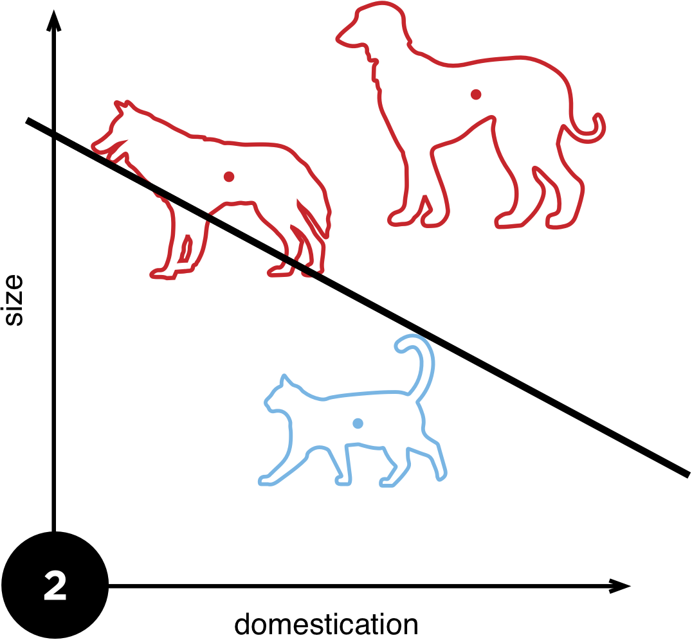
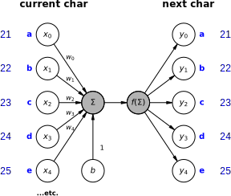
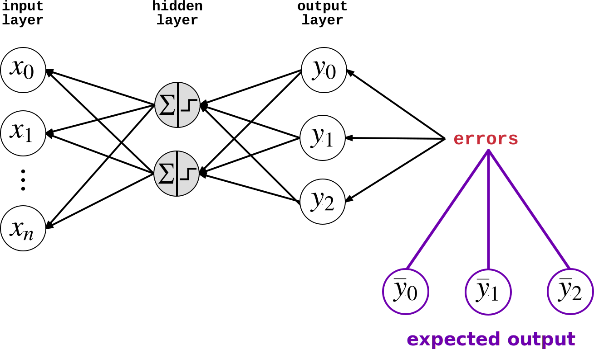
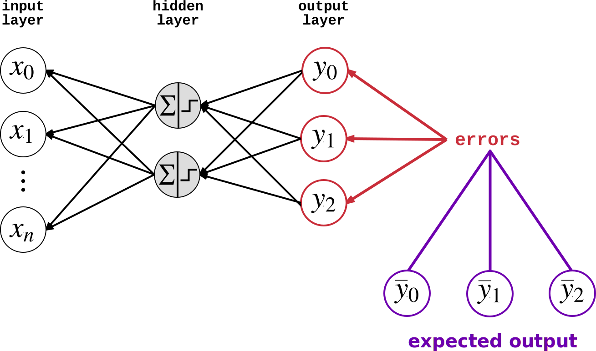

<h2>Deep Learning with Recurrent Neural Networks</h2>
<h4>In Python</h4>
<p>
    <a href="http://donaldwhyte.co.uk">Alejandro Saucedo</a>
    / <a href="http://twitter.com/axsauze">@axsauze</a><br/>
    <a href="http://donaldwhyte.co.uk">Donald Whyte</a>
    / <a href="http://twitter.com/donald_whyte">@donald_whyte</a>
  <br />
</p>
<p>

[NEXT]
By the end of this talk...

Build a TODO.

TODO: state exatcl whay we're going to build and what data we're using from
the very start


[NEXT SECTION]
## 1. Traditional Supervised Learning

Use labelled historical data to predict future outcomes

[NEXT]
Given some input data, predict the correct output


What **features** of the input tell us about the output?

[NEXT]
### Feature Space

* A feature is some property that describes raw input data</li>
* Features represented as a vector in **feature space**
* **Abstract** complexity of raw input for easier processing

<center>
  <div id="shape-plot"></div>
</center>

_note_
In this case, we have 2 features, so inputs are 2D vector that lie in
a 2D feature space.

[NEXT]
### Classification

<div class="left-col">
  <ul>
    <li>Training data is used to produce a model</li>
    <li> *f(x&#x0304;)* = *mx&#x0304;* + *c*</li>
    <li>Model divides feature space into segments</li>
    <li>Each segment corresponds to one <strong>output class</strong></li>
  </ul>
</div>

<div class="right-col">
  <center>
    <div id="shape-plot-discriminant"></div>
  </center>
</div>

<div class="clear-col"></div>

[NEXT]
Use trained model to predict outcome of new, unseen inputs.

TODO: example in equation

[NEXT]
Can this be used to learn how to write novels?

[NEXT]
No.

[NEXT]
Generating coherent text requires memory of what was written previously.

[NEXT]
> <span style="font-weight: bold; color: red">Boris'</span> favourite
> <span style="font-weight: bold; color: blue">drink</span> is
> <span style="font-weight: bold; color: blue">beer.</span>
> <span style="font-weight: bold; color: red">He</span> likes
> <span style="font-weight: bold; color: blue">lagers</span> the most.

<table>
  <tr>
    <th>Male Person</th>
    <td><span style="font-weight: bold; color: red">Boris, he</span></td>
  </tr>
  <tr>
    <th>Drinks</th>
    <td><span style="font-weight: bold; color: blue">drink, beer, lagers</span></td>
  </tr>
  <tr>
  </tr>
</table>

_note_
Other issues with traditional machine learning:

* Does not scale to large numbers of input features
* Relies on you to break raw input data into a small set of useful features
* Good feature engineering requires in-depth domain knowledge and time


[NEXT SECTION]
## 2. Deep Neural Networks

[NEXT]
Deep neural nets can learn to patterns in complex data, like language.

We can encode memory into the algorithm.

_note_
We can encode memory into the algorithm, allowing us to generate more
coherent novels that _remember_ what was previously written.

[NEXT]
Just use the raw input data.

Our training data is the raw text of existing novels.

No need for for manual feature extraction.

[NEXT]
### The Mighty Perceptron

* Equivalent to the straight line equation from before
* Linearly splits feature space
* Modelled after a neuron in the human brain

[NEXT]


[NEXT]
### Perceptron Definition

For `n` features, the perceptron is defined as:

* `n`-dimensional weight vector `w`
* bias scalar `b`
* activation function `f(s)`

[NEXT]
|                     |                                            |
| ------------------- | ------------------------------------------ |
| Input               | $x = \left(x_0, x_1, \cdots, w_n\right)$   |
| Weights             | $w = \left(w_0, w_1, \cdots, w_n\right)$   |
| Bias                | $b$                                        |
| Weighted Sum        | $\left(\sum_{i=0}^{n} {w_ix_i}\right) + b$ |
| Activation Function | $f(s)$                                     |


[NEXT]
### Activation Function

Simulates the 'firing' of a physical neuron

1 = neuron fires, 0 = neuron does not fire

$$
  f(x) = \begin{cases}1 & \text{if }w \cdot x + b > 0\\\\0
  & \text{otherwise}\end{cases}
$$

[NEXT]
### Sigmoid Function

* Can make perceptron produce continuous output
* Required to learn weights (more info on this later)

TODO: make this more relevant to current talk

PLACEHOLDER<!-- .element id="sigmoid-activation-function-chart" -->

_note_
We'll find having a continuous activation function very useful for when we
combine many perceptrons together.

[NEXT]
How do we learn `w` and `b`?

[NEXT]
### Perceptron Learning Algorithm

Algorithm which learns correct weights and bias

Use training dataset to incrementally train perceptron

Guaranteed to create line that divides output classes

(if data is linearly separable)<!-- .element class="small" -->

_note_
Details of the algorithm are not covered here for brevity.

Training dataset, which is a collection of known input/output pairs
(typically produced by humans manually labelling input).

[NEXT]


_note_
TODO: have this learning section? or just make it better?

[NEXT]


[NEXT]


[NEXT]


[NEXT]
### Representing Text

Make the input layer represent:

* a single word
* or a single character

Use the input to word/char to predict the next.

[NEXT]
We will use characters as the inputs.

_note_
There are pros and cons with either representation. Both techniques use the
same principle. You use the input token to _predict_ the next token.

TODO: note down some reasons why we're using chars not words, but no need to
go into detail in the talk unless someone asks

[NEXT]


[NEXT]


<table class="small-table"><tr>
  <td><strong>Input:</strong> <span style="color: blue">b</span></td>
  <td><strong>Predicted char:</strong> <span style="color: red">?</span></td></tr>
  <tr><td><strong>Current sentence:</strong> <span style="color: blue">b</span><span style="color: red">?</span></td></tr>
</table>

[NEXT]


<table class="small-table"><tr>
  <td><strong>Input:</strong> <span style="color: blue">b</span></td>
  <td><strong>Predicted char:</strong> <span style="color: red">a</span></td></tr>
  <tr><td><strong>Current sentence:</strong> <span style="color: blue">b</span><span style="color: red">a</span></td></tr>
</table>

[NEXT]


<table class="small-table"><tr>
  <td><strong>Input:</strong> <span style="color: blue">a</span></td>
  <td><strong>Predicted char:</strong> <span style="color: red">d</span></td></tr>
  <tr><td><strong>Current sentence:</strong> <span style="color: blue">ba</span><span style="color: red">d</span></td></tr>
</table>

[NEXT]
### Problem

Single perceptrons are straight line equations.

Produce a single output.

Need a *network* of neurons to output the full one-hot vector.

[NEXT]
### Neural Networks

Uses *many* perceptrons to:

* learn patterns in complex data, like language
* produce the multiple outputs required for text prediction

[NEXT]


[NEXT]


[NEXT]
|            |                                     |
| ---------- | ----------------------------------- |
| **Input**  | $V$ nodes, a single one-hot vector  |
| **Hidden** | multiple percetrons                 |
| **Output** | $V$ nodes, a single one-hout vector |

where $V$ is the number of characters.

_note_
The hidden layers is where all the smarts comes in. I could spend days
discussing how to choose the number of hidden layers and nodes in each
layer.

It depends on so many factors. The number of input features, the distribution
of inputs across feature space.

[NEXT]
### Neuron Connectivity

* Each layer is **fully connected** to the next
* All nodes in layer $l$ are connected to nodes in layer $l + 1$
* Every single connection has a weight

_note_
Standard neural network architectures make each layer fully connected
to the next.

[NEXT]
Produces multiple **weight matrices**

One for each layer


_note_
Weight matrix produced using the following Latex equation:
W = \begin{bmatrix} w_{00} & w_{01} & \cdots & w_{0n} \\ w_{10} & w_{11} & \cdots & w_{1n} \\ \vdots & \vdots & \vdots & \vdots \\ w_{m0} & w_{m1} & \cdots & w_{mn} \end{bmatrix}

[NEXT]
### Training Neural Networks

Learn the weight matrices!

[NEXT]
Optimisation problem.

[NEXT]
### Gradient Descent Optimiser

Keep adjusting the weights of each hidden layer

In such a way that we minimise incorrect predictions

[NEXT]


Uses **derivatives** of activation functions to adjust weights

_note_

We can describe the principle behind gradient descent as “climbing down a
hill” until a local or global minimum is reached.

We use the **derivatives** of each neuron's activation function to determine
the direction of the error. The direction of error is the gradient.

At each step, we take a step into the **opposite** direction of the gradient.
That is, we adjust the weights so we have _less_ error in the next step.

This is why we typically use an activation function like sigmoid. Sigmoid
provides a continuous output. It is fast and easy to compute the derivative of
continuous functions. If we used a discrete activiation function, it would be
much harder to run gradient descent.

The step size is determined by the value of the **learning rate** as well
as the slope of the gradient.

Source of diagram: https://medium.com/onfido-tech/machine-learning-101-be2e0a86c96a

[NEXT]
### Backpropagation

* Equivalent to gradient descent
* *The* training algorithm for neural networks
* For each feature vector in the training dataset, do a:
  1. forward pass
  2. backward pass

_note_
Backpropagation is the workhorse of neural network training. Some
variation of this algorithm is almost always used to train nets.

For a data point in our training dataset, we run two steps.

Visualisation of learning by backpropagation:
http://www.emergentmind.com/neural-network

[NEXT]
### Forward Pass


_note_
1. Start with random weights
2. Feed input feature vector to input layer
3. Let the first layer evaluate their activation using
4. Feed activation into next layer, repeat for all layers
5. Finally, compute output layer values

[NEXT]
### Forward Pass


[NEXT]
### Forward Pass


[NEXT]
### Forward Pass


[NEXT]
### Backward Pass


_note_
1. Compare the target output to the actual output
  - calculate the errors of the output neurons
2. Calculate weight updates associated with output neurons using perceptron learning principle
  - same adjustments as the ones made in the Perceptron Algorithm)
3. For each output neuron, propagate values back to the previous layer
4. Calculate weight updates associated with hidden neurons using perceptron learning principle
5. Update weights, then repeat from step 1 (performing another forward and backward pass) until the weight values converge

[NEXT]
### Backward Pass


[NEXT]
### Backward Pass


[NEXT]
### Backward Pass


[NEXT]
After training the network, we obtain weights which minimise prediction error.

Predict next character by running the last character through the
**forward pass** step.

[NEXT]
### However...

> <span style="font-weight: bold; color: red">Boris'</span> favourite
> <span style="font-weight: bold; color: blue">drink</span> is
> <span style="font-weight: bold; color: blue">beer.</span>
> <span style="font-weight: bold; color: red">He</span> likes
> <span style="font-weight: bold; color: blue">lagers</span> the most.

Network still has <strong>no memory of past characters</strong>.

_note_
We need to know what the last _N_ characters were to effectively predict the
next character.

Source: http://colah.github.io/posts/2015-08-Understanding-LSTMs/

Humans don’t start their thinking from scratch every second. As you read this essay, you understand each word based on your understanding of previous words. You don’t throw everything away and start thinking from scratch again. Your thoughts have persistence.

Traditional neural networks can’t do this, and it seems like a major shortcoming. For example, imagine you want to classify what kind of event is happening at every point in a movie. It’s unclear how a traditional neural network could use its reasoning about previous events in the film to inform later ones.

Recurrent neural networks address this issue. They are networks with loops in them, allowing information to persist.


[NEXT SECTION]
## 3. Deep Recurrent Networks

_note_
Source of following diagrams is:

http://www.hexahedria.com/2015/08/03/composing-music-with-recurrent-neural-networks/

[NEXT]
### Single neuron &mdash; one output


[NEXT]
### Neural network &mdash; multiple outputs


[NEXT]
### Deep Networks &mdash; many hidden layers


[NEXT]
### Simplified Visualisation


One node represents a full layer of neurons.

_note_
TODO: clearly graph the expansion of one node to an input layer

[NEXT]
### Recurrent Networks


Each node's input includes the output of itself during the last run of the
network.

[NEXT]
### Unrolled Recurrent Network


Previous predictions help make the _next_ prediction.

Each prediction is a **time step**.

[NEXT]


[NEXT]


[NEXT]


[NEXT]


_note_
TODO: notes on chars example?

[NEXT]
### Problem:

Long-term dependencies

[NEXT]

TODO: update diagram to higlight long term dependencies between time axes
TODO: also add letters from preivous one


[NEXT]
### Cell States

TODO: update diagram to include hidden cell lines

TODO: mark hidden state as H (a "hidden state")


* TODO
* TODO
* Many variants: LSTM, GRU, etc.

[NEXT]


[NEXT]
TODO: re-emphasize what these networks are good for

[NEXT]

TODO: explain how training the RNN is basically the same as before!!

TODO: just introduce the fact that we do two loops (one per input,
one per char in sequence)


[NEXT SECTION]
## 4. RNNs in Python

[NEXT]
Building a neural network involves:

* defining its architecture
* learning the weight matrices for that architecture

[NEXT]


_note_
Source: https://devblogs.nvidia.com/parallelforall/recursive-neural-networks-pytorch/

Here is a small section of the computation graph required to train a simple
recurrent network.

[NEXT]


_note_
Source: https://geekyisawesome.blogspot.co.uk/2016/06/the-backpropagation-algorithm-for.html

This is some of the algebra require for one step of backpropagaiton/training
for a single layer. And this is basic neural network with loops or cell states.

[NEXT]
### Python Neural Net Libraries


_note_
Allows user to write symbolic mathematical expressions, then automatically generates their derivatives, saving the user from having to code gradients or backpropagation. These symbolic expressions are automatically compiled to CUDA code for a fast, on-the-GPU implementation.

Theano: The reference deep-learning library for Python with an API largely compatible with the popular NumPy library.

[NEXT]


* Can build very complex networks quickly
* Easy to extend if required
* Built-in support for RNN memory cells
* Good visualisation tools


[NEXT SECTION]
## 5. Tensorflow

[NEXT]
TODO: diagram of full desired architecture (no tensorflow artefacts)

[NEXT]
### Goal

Build a computation graph that learns the weights of this network.

_note_
TODO

[NEXT]
### The Computation Graph
|                |                                                                                   |
| -------------  | --------------------------------------------------------------------------------- |
| `tf.Tensor`    | Unit of data. An _n_ dimensional array of numbers.        |
| `tf.Operation` | Unit of computation. Takes 0+ `tf.Tensor`s as inputs and outputs 0+ `tf.Tensor`s. |
| `tf.Graph`     | Collection of connected `tf.Tensor`s and `tf.Operation`s. |

Operations are nodes and tensors are edges.

[NEXT]
```python
node1 = tf.constant(3.0, dtype=tf.float32)
node2 = tf.constant(4.0) # also tf.float32 implicitly
print(node1)
print(node2)
```

Output:

```bash
Tensor("Const:0", shape=(), dtype=float32)
Tensor("Const_1:0", shape=(), dtype=float32)
```

[NEXT]
Many built-in `tf.Operation`s:

|            |                                                                    |
| ---------- | ------------------------------------------------------------------ |
| `constant` | outputs a constant tensor                                          |
| `reshape`  | reshapes an input tensor to a new tensor with different dimensions |
| `add`      | add values of two tensors                                          |
| `matmul`   | multiplys two matrices                                             |

[NEXT]
`tf.Session`

Used to execute a computation graph.

[NEXT]
```python
# Put an "addition" operation on the graph.
node3 = tf.add(node1, node2)

# Create a session and run the root node of the graph.
session = tf.Session()
print(session.run([node3]))
```

Output:

```bash
7.0
```

[NEXT]
`tf.Placeholder`

Defines a node whose vlaue is not yet determined.

The value is filled in later, before the graph is executed.

These are used to define neural network inputs.

_note_
For us, the inputs will be those one-hot vector inputs that represent
characters which I showed you before.

[NEXT]
```python
# Define a 2D input vector that stores the two input features
# for shape classification.
#
# The features were: [area, perimeter]
inputs = tf.placeholder(tf.float32, [2])
```

[NEXT]

```python
# Graph Node 1: inputs
inputs = tf.placeholder(tf.float32, [2])
# Graph Node 2: an internal operation
multiplied_inputs = tf.scalar_mul(3, inputs)
# Graph Node 3: final output
output_sum = tf.reduce_sum(multiplied_inputs)

# Run the graph.
session = tf.Session()
result = session.run(output_sum, feed_dict={inputs: [10, 15]})
print(result)
```

Output

```
75.0
```

[NEXT]
TODO: graph that shows visualisation of this input grapbh

^--- need to do on home network

[NEXT]

1. Define graph nodes: `tf.Placeholder`s
  - input data
  - e.g. the previous char used to predict the next char
2. Define graph edges: `tf.Operation`s
  - architecture of the network
  - evaluation and optimiser operations
4. Define `tf.Session`
  - call `run()` and pass in root of computation graph

[NEXT]
TODO: diagram of full desired architecture (no tensorflow artefacts)

[NEXT]
TODO: marked diagram with raw input layer

[NEXT]
TODO: marked diagram with one-hot input layer

[NEXT]
TODO: marked diagram with expected output and expected one-hot layers

[NEXT]
TODO: marked diagram with deep RNN cell layers

[NEXT]
TODO: create tuple of placeholders of cell states (this are placeheholders)

[NEXT]
TODO: dynamic RNN and the H node

[NEXT]
TODO: softmax layer implementation + flattening for the output

[NEXT]
TODO: output one-hot to single char

[NEXT]
Remaining tasks:

* define our loss function
* decide what weight optimiser to use

[NEXT]
TODO: loss function (only actual loss function, forget about stats)

[NEXT]
TODO: optimiser


[NEXT SECTION]
## 6. Training the Model

[NEXT]
TODO: loading the data details

_note_
Emphasise the fact that you load all of the textual data in as integer-coded
chars. All documents are flattened into a single large sequence.

[NEXT]
TODO: creating session and init vars

[NEXT]
TODO: init run to initialise state to zeros

[NEXT]
TODO: concept of mini-batching

[NEXT]
TODO: some code to split things to into batches.

(probably omit the details, show explain the underlying concept of splitting
one big large sequence)

[NEXT]
DEMO!

_note_
Briefly show real code and and start running training. Run through one batch
and see how the loss is reduced.

[NEXT]
### Tensorboard

TODO: what it is

[NEXT]
Add stats logging to your code:

```python
TODO
```

Run Tensorboard:

```
tensorboard --logdir logs
```

_note_
Show what code you need to add in the real example code. Explain that it logs
data to a file and is then picked up by a local web server.

Run tensorboard and show the following:

* computation graph
* accuracy measures


[NEXT SECTION]
## 7. Using Trained Models

[NEXT]
TODO: how to save the model weights (the Saver object)

[NEXT]
TODO: loading model from scratch

[TEXT]
TODO: using it to generate new text

_note_
Demonstrate this using a pre-trained model that is good at generating the
target text. It will take too long for the model to be trained from scratch
live.


[NEXT SECTION]
## Fin

[TEXT]
TODO: conclusion

[TEXT]
TODO: further reading

[NEXT]
TODO: contact details, Twitters, blog, etc.
