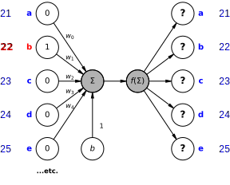
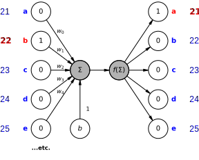
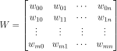
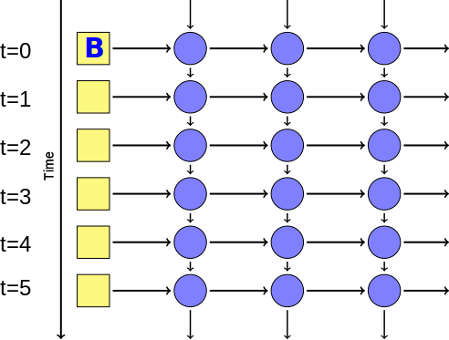
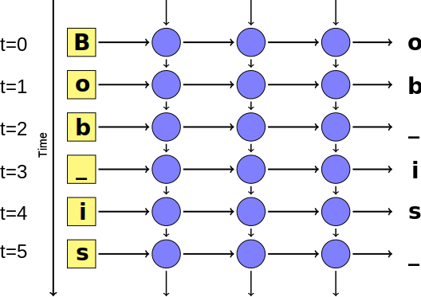
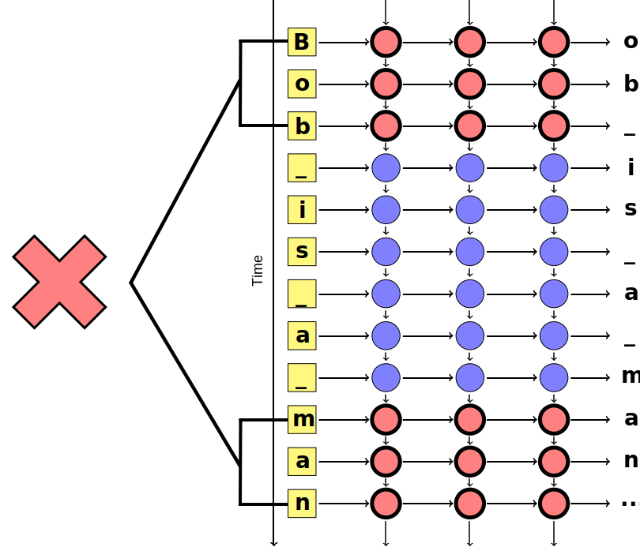
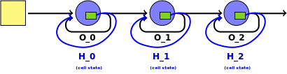
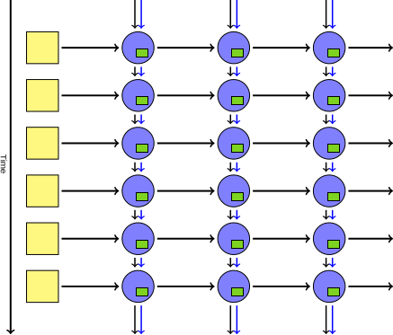

<!-- .slide: data-background="images/books_opened.jpg" class="background" -->

<h2>Deep Learning with Recurrent Neural Networks</h2>
<h4>In Python</h4>
<p>
    <a href="http://donaldwhyte.co.uk">Donald Whyte</a>
    / <a href="http://twitter.com/donald_whyte">@donald_whyte</a>
    <br />
    <a href="http://donaldwhyte.co.uk">Alejandro Saucedo</a>
    / <a href="http://twitter.com/axsauze">@axsauze</a><br/>
  <br />
</p>
<p>

[NEXT]
<!-- .slide: data-background="images/books_opened.jpg" class="background large" -->

Create an AI author.

[NEXT]
<!-- .slide: data-background="images/books_opened.jpg" class="background" -->

> Lorem ipsum dolor sit amet, consectetur adipiscing elit. Pellentesque viverra imperdiet erat, nec ultricies sem elementum eget. Phasellus velit ligula, efficitur ac orci quis, aliquet malesuada tellus. Aliquam a elit pulvinar, pellentesque nunc a, rutrum est. Etiam rhoncus dignissim est et lobortis. Vivamus porta tincidunt congue. In tempor dapibus enim. Ut et arcu augue.

_note_
TODO: example of its output (after we've got a network fully trained)

TODO: if find time, disable transition between bg and non-bg slides

[NEXT]
<!-- .slide: data-background="images/books_opened.jpg" class="background" -->
Create a neural network that can write novels.

Use 30,000 English novels to train the network.


[NEXT SECTION]
## 1. Traditional Supervised Learning

Use labelled historical data to predict future outcomes

[NEXT]
Given some input data, predict the correct output


What **features** of the input tell us about the output?

[NEXT]
### Feature Space

* A feature is some property that describes raw input data</li>
* Features represented as a vector in **feature space**
* **Abstract** complexity of raw input for easier processing

<center>
  <div id="shape-plot"></div>
</center>

_note_
In this case, we have 2 features, so inputs are 2D vector that lie in
a 2D feature space.

[NEXT]
### Classification

<div class="left-col">
  <ul>
    <li>Training data is used to produce a model</li>
    <li>$f(x̄) = mx̄ + c$</li>
    <li>Model divides feature space into segments</li>
    <li>Each segment corresponds to one <strong>output class</strong></li>
  </ul>
</div>

<div class="right-col">
  <center>
    <div id="shape-plot-discriminant1"></div>
  </center>
</div>

<div class="clear-col"></div>

[NEXT]
Use trained model to predict outcome of new, unseen data.

[NEXT]
### Example

<div class="left-col">
  <center>
    <div id="shape-plot-discriminant2"></div>
  </center>
</div>

<div class="right-col">
  <br />
  <br />
  <p>$m = ()$</p>
  <p>$c = 1$</p>
</div>

[NEXT]

-2area + 1perim = 0

3.5 * 2 +


Using this model, let's predict what shape an object is.

Object properties: **area** = 3, **perimeter** = 0.5

Input becomes:

$x̄ = (3, 0.5)$

[NEXT]

TODO: fill in once you know how to compute weights and biases

$f(x̄) = mx̄ + c$

$f((3, 0.5)) = (TODO, TODO)(3, 0.5) + TODO$

$f((3, 0.5)) = (TODO, TODO)(3, 0.5) + c$

$f(x) = ()$

[NEXT]
<div class="left-col">
  <center>
    <div id="shape-plot-classified-point"></div>
  </center>
</div>

<div class="right-col">
  <p>$x̄ = (3, 0.5)$</p>
  <p>$f(x̄) = TODO$</p>
  <p>TODO < 0</p>
  <p>left side of the line</p>
  <p>means input is a **triangle**</p>
</div>

_note_
Point is on the left hand of the side. With the model we've used, this means
that we classify the input point as a triangle!

Point out that this same technique can used to predicting continuous, numerical
values too (like how much house prices will cost, or how much a stock's price
will go up or down).

[NEXT]
### The Hard Part

Learning $m$ and $c$.

[NEXT]
Can this be used to learn how to write novels?

[NEXT]
**No.**

[NEXT]
Generating coherent text requires memory of what was written previously.

[NEXT]
> <span style="font-weight: bold; color: red">Boris'</span> favourite
> <span style="font-weight: bold; color: blue">drink</span> is
> <span style="font-weight: bold; color: blue">beer.</span>
> <span style="font-weight: bold; color: red">He</span> likes
> <span style="font-weight: bold; color: blue">lagers</span> the most.

<table>
  <tr>
    <th>Male Person</th>
    <td><span style="font-weight: bold; color: red">Boris, he</span></td>
  </tr>
  <tr>
    <th>Drinks</th>
    <td><span style="font-weight: bold; color: blue">drink, beer, lagers</span></td>
  </tr>
  <tr>
  </tr>
</table>

_note_
Other issues with traditional machine learning:

* Does not scale to large numbers of input features
* Relies on you to break raw input data into a small set of useful features
* Good feature engineering requires in-depth domain knowledge and time


[NEXT SECTION]
## 2. Deep Neural Networks

[NEXT]
Deep neural nets can learn to patterns in complex data, like language.

We can encode memory into the algorithm.

_note_
We can encode memory into the algorithm, allowing us to generate more
coherent novels that _remember_ what was previously written.

[NEXT]
Just use the raw input data.

Our training data is the raw text of existing novels.

No need for for manual feature extraction.

[NEXT]
### The Mighty Perceptron

* Equivalent to the straight line equation from before
* Linearly splits feature space
* Modeled after a neuron in the human brain

[NEXT]


[NEXT]
### Perceptron Definition

For `n` features, the perceptron is defined as:

* `n`-dimensional weight vector `w`
* bias scalar `b`
* activation function `f(s)`

[NEXT]
|                     |                                            |
| ------------------- | ------------------------------------------ |
| Input               | $x = \left(x_0, x_1, \cdots, w_n\right)$   |
| Weights             | $w = \left(w_0, w_1, \cdots, w_n\right)$   |
| Bias                | $b$                                        |
| Weighted Sum        | $\left(\sum_{i=0}^{n} {w_ix_i}\right) + b$ |
| Activation Function | $f(s)$                                     |


[NEXT]
### Activation Function

Simulates the 'firing' of a physical neuron.

Takes the weighted sum and squashes it into a smaller range.

[NEXT]
### Sigmoid Function

* Squashes perceptron output into range [0,1]
* Used to learn weights (`w`)

PLACEHOLDER<!-- .element id="sigmoid-activation-function-chart" -->

_note_
We'll find having a continuous activation function is very useful when we want
to learn the values of the perceptron weights.

[NEXT]
How do we learn `w` and `b`?

[NEXT]
### Perceptron Learning Algorithm

Algorithm which learns correct weights and bias

Use training dataset to incrementally train perceptron

Guaranteed to create line that divides output classes

(if data is linearly separable)<!-- .element class="small" -->

_note_
Details of the algorithm are not covered here for brevity.

Training dataset, which is a collection of known input/output pairs
(typically produced by humans manually labelling input).

[NEXT]


[NEXT]


[NEXT]


[NEXT]


[NEXT]
### Representing Text

Make the input layer represent:

* a single word
* or a single character

Use the input to word/char to predict the next.

[NEXT]
We will use characters as the inputs.

_note_
There are pros and cons with either representation. Both techniques use the
same principle. You use the input token to _predict_ the next token.

Both words and characters are valid ways of representing text in neural
networks. Representing the input as characters is an easier approach and for
many tasks, actually results in better performing networks.

We don't have time to go into more detail in this talk, but feel free to ask
us for more details afterwards.

TODO: note down some reasons why we're using chars not words, but no need to
go into detail in the talk unless someone asks

[NEXT]


[NEXT]


<table class="small-table"><tr>
  <td><strong>Input:</strong> <span style="color: blue">b</span></td>
  <td><strong>Predicted char:</strong> <span style="color: red">?</span></td></tr>
  <tr><td><strong>Current sentence:</strong> <span style="color: blue">b</span><span style="color: red">?</span></td></tr>
</table>

[NEXT]


<table class="small-table"><tr>
  <td><strong>Input:</strong> <span style="color: blue">b</span></td>
  <td><strong>Predicted char:</strong> <span style="color: red">a</span></td></tr>
  <tr><td><strong>Current sentence:</strong> <span style="color: blue">b</span><span style="color: red">a</span></td></tr>
</table>

[NEXT]


<table class="small-table"><tr>
  <td><strong>Input:</strong> <span style="color: blue">a</span></td>
  <td><strong>Predicted char:</strong> <span style="color: red">d</span></td></tr>
  <tr><td><strong>Current sentence:</strong> <span style="color: blue">ba</span><span style="color: red">d</span></td></tr>
</table>

[NEXT]
### Problem

Single perceptrons are straight line equations.

Produce a single output.

Need a *network* of neurons to output the full one-hot vector.

[NEXT]
### Neural Networks

Uses *many* perceptrons to:

* learn patterns in complex data, like language
* produce the multiple outputs required for text prediction

[NEXT]


[NEXT]


[NEXT]
|            |                                     |
| ---------- | ----------------------------------- |
| **Input**  | $V$ nodes, a single one-hot vector  |
| **Hidden** | multiple percetrons                 |
| **Output** | $V$ nodes, a single one-hout vector |

where $V$ is the number of characters.

_note_
The hidden layers is where all the smarts comes in. I could spend days
discussing how to choose the number of hidden layers and nodes in each
layer.

It depends on so many factors. The number of input features, the distribution
of inputs across feature space.

[NEXT]
### Neuron Connectivity

* Each layer is **fully connected** to the next
* All nodes in layer $l$ are connected to nodes in layer $l + 1$
* Every single connection has a weight

_note_
Standard neural network architectures make each layer fully connected
to the next.

[NEXT]
Produces multiple **weight matrices**

One for each layer



_note_
Weight matrix produced using the following Latex equation:
W = \begin{bmatrix} w_{00} & w_{01} & \cdots & w_{0n} \\ w_{10} & w_{11} & \cdots & w_{1n} \\ \vdots & \vdots & \vdots & \vdots \\ w_{m0} & w_{m1} & \cdots & w_{mn} \end{bmatrix}

[NEXT]
### Training Neural Networks

Learn the weight matrices!

[NEXT]
Optimisation problem.

[NEXT]
### Gradient Descent Optimiser

Keep adjusting the weights of each hidden layer

In such a way that we minimise incorrect predictions

[NEXT]


Uses **derivatives** of activation functions to adjust weights

_note_

We can describe the principle behind gradient descent as “climbing down a
hill” until a local or global minimum is reached.

We use the **derivatives** of each neuron's activation function to determine
the direction of the error. The direction of error is the gradient.

At each step, we take a step into the **opposite** direction of the gradient.
That is, we adjust the weights so we have _less_ error in the next step.

This is why we typically use an activation function like sigmoid. Sigmoid
provides a continuous output. It is fast and easy to compute the derivative of
continuous functions. If we used a discrete activiation function, it would be
much harder to run gradient descent.

The step size is determined by the value of the **learning rate** as well
as the slope of the gradient.

Source of diagram: https://medium.com/onfido-tech/machine-learning-101-be2e0a86c96a

[NEXT]
### Backpropagation

* Equivalent to gradient descent
* *The* training algorithm for neural networks
* For each feature vector in the training dataset, do a:
  1. forward pass
  2. backward pass

_note_
Backpropagation is the workhorse of neural network training. Some
variation of this algorithm is almost always used to train nets.

For a data point in our training dataset, we run two steps.

Visualisation of learning by backpropagation:
http://www.emergentmind.com/neural-network

[NEXT]
### Forward Pass


_note_
1. Start with random weights
2. Feed input feature vector to input layer
3. Let the first layer evaluate their activation using
4. Feed activation into next layer, repeat for all layers
5. Finally, compute output layer values

[NEXT]
### Forward Pass


[NEXT]
### Forward Pass


[NEXT]
### Forward Pass


[NEXT]
### Backward Pass


_note_
1. Compare the target output to the actual output
  - calculate the errors of the output neurons
2. Calculate weight updates associated with output neurons using perceptron learning principle
  - same adjustments as the ones made in the Perceptron Algorithm)
3. For each output neuron, propagate values back to the previous layer
4. Calculate weight updates associated with hidden neurons using perceptron learning principle
5. Update weights, then repeat from step 1 (performing another forward and backward pass) until the weight values converge

[NEXT]
### Backward Pass


[NEXT]
### Backward Pass


[NEXT]
### Backward Pass


[NEXT]
After training the network, we obtain weights which minimise prediction error.

Predict next character by running the last character through the
**forward pass** step.

[NEXT]
### However...

> <span style="font-weight: bold; color: red">Boris'</span> favourite
> <span style="font-weight: bold; color: blue">drink</span> is
> <span style="font-weight: bold; color: blue">beer.</span>
> <span style="font-weight: bold; color: red">He</span> likes
> <span style="font-weight: bold; color: blue">lagers</span> the most.

Network still has <strong>no memory of past characters</strong>.

_note_
We need to know what the last _N_ characters were to effectively predict the
next character.

Source: http://colah.github.io/posts/2015-08-Understanding-LSTMs/

Humans don’t start their thinking from scratch every second. As you read this essay, you understand each word based on your understanding of previous words. You don’t throw everything away and start thinking from scratch again. Your thoughts have persistence.

Traditional neural networks can’t do this, and it seems like a major shortcoming. For example, imagine you want to classify what kind of event is happening at every point in a movie. It’s unclear how a traditional neural network could use its reasoning about previous events in the film to inform later ones.

Recurrent neural networks address this issue. They are networks with loops in them, allowing information to persist.


[NEXT SECTION]
## 3. Deep Recurrent Networks

_note_
Source of following diagrams is:

http://www.hexahedria.com/2015/08/03/composing-music-with-recurrent-neural-networks/

[NEXT]
### Single neuron &mdash; one output


[NEXT]
### Neural network &mdash; multiple outputs


[NEXT]
### Deep Networks &mdash; many hidden layers


[NEXT]
### Simplified Visualisation


One node represents a full layer of neurons.

[NEXT]


[NEXT]
### Recurrent Networks


Each node's input includes the output of itself during the last run of the
network.

Output of node $i$ is denoted by $H_i$.

[NEXT]
### Unrolled Recurrent Network
Previous predictions help make the _next_ prediction.

Each prediction is a **time step**.


[NEXT]


[NEXT]


[NEXT]


[NEXT]


[NEXT]


[NEXT]


[NEXT]


[NEXT]


[NEXT]


[NEXT]
### Problem: Long-Term Dependencies



[NEXT]
### Cell States

Add **extra state** to each layer of the network.

Remembers inputs **far into the past**.

Transforms layer's original output into something that is **relevant** to
the current context.

_note_
This extra state stores information on inputs from much earlier time steps.

The state transforms the hidden layer's original output into something that is
relevant to the current context, given what's happened in the past.

[NEXT]
TODO"



[NEXT]


[NEXT]
Hidden layer output _and_ cell state is feed into next time step.

Gives network ability to handle long-term dependencies in sequences.

_note_
Feeding the output of a hidden layer _and_ its internal cell state back into
itself at the next time step allows the network to express long-term
dependencies in sequences.

For example, the network will be able to remember the subject at the start of
a paragraph of text at the very end of the paragraph, allowing it to generate
text that makes sense in context.

This works because the cell state is built to store past time steps in a
memory and CPU efficient way. So even though the cell state memory footprint is
small (e.g. 100-200 bytes), it can remember things quite far in the past.

[NEXT]


_note_

Note that there is still a limit to how far back networks with cell states can
remember. So we reduce the problems expressing long-term dependencies, but we
don't get rid of it entirely.

[NEXT]
http://colah.github.io/posts/2015-08-Understanding-LSTMs/

_note_

Unfortunately, we don't have time in this talk to go into detail on how cell
states are represented and the different types.

So for this talk, we will treat the state as a "§box" and believe it
solves the long-term dependency problem.

Here's a link to a great article that explains the most commonly used cell
state technique in great detail.

[NEXT SECTION]
### 4. Training RNNs

[NEXT]
These recurrent networks are trained in the same way as regular network.

[NEXT]
**Backpropagation and gradient descent**.


[NEXT]


[NEXT]
We need data to train the network.

[NEXT]
#### Gutenberg Datatset

Contains 34,000 English novels.

**https://www.gutenberg.org/**

_note_
Project Gutenberg offers over 54,000 free eBooks: Choose among free epub books, free kindle books, download them or read them online. You will find the world's great literature here, especially older works for which copyright has expired. We digitized and diligently proofread them with the help of thousands of volunteers.

[NEXT]


_note_
1. merge all 30000 novels into a single text document
2. load single document as a flat sequence of characters
3. filter out characters we don't care about
4. map each char to an integer
  - integer decides which _input value_ is set to 0

**Result**: sequence of integers

_notes_
Emphasise the fact that you load all of the textual data in as integer-coded
chars. All documents are flattened into a single large sequence.

[NEXT]
Common training methods:

|                |     |
| -------------- | ---- |
| **Stochastic** | Run backpropagation after processing **one** sequence |
| **Batch**      | Run backpropagation after processing **all** sequences |
| **Mini-Batch** | Run backpropagation after processing a **smaller batch** of $b$ sequences |

[NEXT]
We'll use mini-batch.

[NEXT]
Iterate across all batches.

Run backpropagation after processing each batch.


_note_
Split all the sequences into smaller batches of sequences.

Typically, batch size is between 30 and 100.


[NEXT SECTION]
## 5. Neural Nets in Python

[NEXT]
Building a neural network involves:

1. defining its architecture
2. learning the weight matrices for that architecture

_note_
1. e.g. number of layers, whether to have loops, what type of cell state to use
2. running an optimiser like gradient descent to train network on training dataset

[NEXT]


_note_
Source: https://devblogs.nvidia.com/parallelforall/recursive-neural-networks-pytorch/

Here is a small section of the computation graph required to train a simple
recurrent network.

[NEXT]


_note_
Source: https://geekyisawesome.blogspot.co.uk/2016/06/the-backpropagation-algorithm-for.html

This is some of the algebra require for one step of backpropagaiton/training
for a single layer. And this is basic neural network with lno oops or cell states.

[NEXT]
### Python Neural Net Libraries


_note_
Allows user to write symbolic mathematical expressions, then automatically generates their derivatives, saving the user from having to code gradients or backpropagation. These symbolic expressions are automatically compiled to CUDA code for a fast, on-the-GPU implementation.

Theano: The reference deep-learning library for Python with an API largely compatible with the popular NumPy library.

[NEXT]


* Can build very complex networks quickly
* Easy to extend if required
* Built-in support for RNN memory cells
* Good visualisation tools


[NEXT SECTION]
## 6. Tensorflow

#### The Basics

[NEXT]
TODO: diagram of full desired architecture (no tensorflow artefacts)

[NEXT]
### Goal

Build a computation graph that learns the weights of this network.

[NEXT]
### The Computation Graph

|                |                                                                                   |
| -------------  | --------------------------------------------------------------------------------- |
| `tf.Tensor`    | Unit of data. An _n_ dimensional array of numbers.        |
| `tf.Operation` | Unit of computation. Takes 0+ `tf.Tensor`s as inputs and outputs 0+ `tf.Tensor`s. |
| `tf.Graph`     | Collection of connected `tf.Tensor`s and `tf.Operation`s. |

Operations are nodes and tensors are edges.

[NEXT]
TODO: show example graph

[NEXT]
`tf.Operation`

Receives constants or `tf.Tensor`s as inputs.

Outputs `tf.Tensor`s.

[NEXT]
```python
node1 = tf.constant(3.0, dtype=tf.float32)
node2 = tf.constant(4.0) # also tf.float32 implicitly
print(node1)
print(node2)
```

Output:

```bash
Tensor("Const:0", shape=(), dtype=float32)
Tensor("Const_1:0", shape=(), dtype=float32)
```

[NEXT]
Many built-in `tf.Operation`s:

|            |                                                                    |
| ---------- | ------------------------------------------------------------------ |
| `constant` | outputs a constant tensor                                          |
| `reshape`  | reshapes an input tensor to a new tensor with different dimensions |
| `add`      | add values of two tensors                                          |
| `matmul`   | multiplys two matrices                                             |

[NEXT]
`tf.Session`

Used to execute a computation graph.

[NEXT]
```python
# Put an "addition" operation on the graph.
node3 = tf.add(node1, node2)

# Create a session and run the root node of the graph.
session = tf.Session()
print(session.run([node3]))
```

Output:

```bash
7.0
```

[NEXT]
`tf.Placeholder`

Defines a node whose value is not yet determined.

The value is filled in later, before the graph is executed.

These are used to define neural network inputs.

_note_
For us, the inputs will be those one-hot vector inputs that represent
characters which I showed you before.

[NEXT]
```python
# Define a 2D input vector that stores the two input features
# for shape classification.
#
# The features were: [area, perimeter]
inputs = tf.placeholder(tf.float32, [2])
```

[NEXT]

```python
# Graph Node 1: inputs
inputs = tf.placeholder(tf.float32, [2])
# Graph Node 2: an internal operation
multiplied_inputs = tf.scalar_mul(3, inputs)
# Graph Node 3: final output
output_sum = tf.reduce_sum(multiplied_inputs)

# Run the graph.
session = tf.Session()
result = session.run(output_sum, feed_dict={inputs: [10, 15]})
print(result)
```

Output

```
75.0
```

[NEXT]
TODO: graph that shows visualisation of this input graph (show same graph as
previous example)

[NEXT]

1. Define graph nodes: `tf.Placeholder`s
  - input data
  - e.g. the previous char used to predict the next char
2. Define graph edges: `tf.Operation`s
  - architecture of the network
  - evaluation and optimiser operations
4. Define `tf.Session`
  - call `run()` and pass in root of computation graph


[NEXT SECTION]
## 7. Tensorflow

#### Building our Model

[NEXT]
TODO: diagram of full desired architecture (no tensorflow artefacts)

[NEXT]
```python
SEQUENCE_LEN = 30
BATCH_SIZE = 200
ALPHABET_SIZE = 98
```

[NEXT]
TODO: marked diagram with raw input layer

```python
# Dimensions: [ BATCH_SIZE, SEQUENCE_LEN ]
X = tf.placeholder(tf.uint8, [None, None], name='X')
```

[NEXT]
TODO: marked diagram with one-hot input layer

```python
# Dimensions: [ BATCH_SIZE, SEQUENCE_LEN, ALPHABET_SIZE ]
Xo = tf.one_hot(X, ALPHABET_SIZE, 1.0, 0.0)
```

[NEXT]
TODO: marked diagram with deep RNN cell layers

_note_
Recap how the deep RNN cell layers work.

[NEXT]
TODO: marked diagram with deep RNN cell layers

```python
HIDDEN_LAYER_SIZE = 512
NUM_HIDDEN_LAYERS = 3
```

[NEXT]
TODO: marked diagram with deep RNN cell layers

Define hidden layers and cell states:

```python
from tensorflow.contrib import rnn

# [ BATCH_SIZE, HIDDEN_LAYER_SIZE * NUM_HIDDEN_LAYERS]
H_in = tf.placeholder(
  tf.float32,
  [None, HIDDEN_LAYER_SIZE * NUM_HIDDEN_LAYERS],
  name='H_in')

# Create desired number of hiddens layers that use the `GRUCell` for
# managing state.
cells = [rnn.GRUCell(HIDDEN_LAYER_SIZE) for _ in range(NUM_HIDDEN_LAYERS)]
multicell = rnn.MultiRNNCell(cells)
```

_note_
Point out that GRU cells is one of the most common methods for storing cell
states in hidden layers.

LSTM vs GRU difference:

From: https://www.quora.com/Are-GRU-Gated-Recurrent-Unit-a-special-case-of-LSTM

The other answer is already great. Just to add, GRU is related to LSTM as both
are utilizing different way if gating information to prevent vanishing gradient
problem.

GRU is relatively new, and from what I can see it's performance is on par with
LSTM, but computationally more efficient (less complex structure as pointed
out). So we are seeing it being used more and more.

[NEXT]
Wrap recurrent hidden layers in `tf.dynamic_rnn`.

Unroll the loops when the computation graph is running.

The loops will be unrolled `SEQUENCE_LENGTH` times.

```
# Outputs:
#    * TODO
#    * TODO

Yr, H_out = tf.nn.dynamic_rnn(
    multicell,
    Xo,
    dtype=tf.float32,
    initial_state=H_in)
```

_note_
The loops will be unrolled `SEQUENCE_LENGTH` times. You can think of this as us
copying all the hidden layer nodes for each unroll, creating a computation
graph that has 30 sets of hidden layers.

[NEXT]
TODO: mark on graph softmax layer

[NEXT]
```python
from tensorflow.contrib import layers

# [ BATCH_SIZE x SEQUENCE_LEN, HIDDEN_LAYER_SIZE ]
Yflat = tf.reshape(Yr, [-1, HIDDEN_LAYER_SIZE])
# [ BATCH_SIZE x SEQUENCE_LEN, ALPHABET_SIZE ]
Ylogits = layers.linear(Yflat, ALPHABET_SIZE)
# [ BATCH_SIZE x SEQUENCE_LEN, ALPHABET_SIZE ]
Yo = tf.nn.softmax(Ylogits, name='Yo')
```

_note_
Flatten the first two dimensions of the output:

[ BATCHSIZE, SEQLEN, ALPHASIZE ] => [ BATCHSIZE x SEQLEN, ALPHASIZE ]

Then apply softmax readout layer. The output of the softmax `Yo` is the
probability distribution

With this readout layer, the weights and biases are shared across unrolled time
steps. Doing this treats values coming from a single sequence time step (one
char) and values coming from a mini-batch run as the same thing.

[NEXT]
TODO: mark on graph the one-hot layer and final output

```
# [ BATCH_SIZE * SEQUENCE_LEN ]
Y = tf.argmax(Yo, 1)
# [ BATCH_SIZE, SEQUENCE_LEN ]
Y = tf.reshape(Y, [BATCH_SIZE, -1], name="Y")
```


[NEXT]
Remaining tasks:

* define our loss function
* decide what weight optimiser to use

[NEXT]
### Loss Function

Needs:

1. the **real** output of the network after each batch
2. the **expected** output (from our training data)

Used to compute a "loss" number that indicates how well the networking is
is predicting the next char.

[NEXT]
TODO: marked diagram with expected output and expected one-hot layers

```python
# [ BATCH_SIZE, SEQUENCE_LEN ]
Y_ = tf.placeholder(tf.uint8, [None, None], name='Y_')
# [ BATCH_SIZE, SEQUENCE_LEN, ALPHABET_SIZE ]
Yo_ = tf.one_hot(Y_, ALPHABET_SIZE, 1.0, 0.0)

# [ BATCH_SIZE x SEQUENCE_LEN, ALPHABET_SIZE ]
Yflat_ = tf.reshape(Yo_, [-1, ALPHABET_SIZE])
```

[NEXT]
Defining the loss function:

```
# [ BATCH_SIZE * SEQUENCE_LEN ]
loss = tf.nn.softmax_cross_entropy_with_logits(
    logits=Ylogits,
    labels=Yflat_)
# [ BATCH_SIZE, SEQUENCE_LEN ]
loss = tf.reshape(loss, [BATCH_SIZE, -1])
```

_note_
We don't have time to cover the details of this loss function. All you need to
know for this talk is that is a commonly used loss function when predicting
discrete values like characters.

[NEXT]
Choose an optimiser.

Will adjust network weights to minimise the `loss`.

```
train_step = tf.train.AdamOptimizer(lr).minimize(loss)
```

[NEXT SECTION]
## 7. Tensorflow

#### Training the Model

[NEXT]
### Epochs

We run mini-batch training on the network.

Train network on _all_ batches multiple times.

Each run across all batches is an **epoch**.

**More epochs = better weights = better accuracy.**

_note_
Of course, the downside of running loads of epochs is that it takes much
longer to train the network.

[NEXT]
```python
# Contains: [Training Data, Test Data, Epoch Number]
Batch = Tuple[np.matrix, np.matrix, int]

def rnn_minibatch_generator(
        data: List[int],
        batch_size: int,
        sequence_length: int,
        num_epochs: int) -> Generator[Batch, None, None]:

    for epoch in range(num_epochs):
        for batch in range(num_batches):
            # split data into batches, where each batch contains `b` sequences
            # of length `sequence_length`.
            training_data = ...
            test_data = ...
            yield training_data, c, epoch
```

_note_
Omit the details, just explain the underlying concept of splitting one big
large sequence into more sequences.

[NEXT]
```python
# Initialize the hidden cell states to 0 before running any steps.
input_state = np.zeros([BATCH_SIZE, HIDDEN_LAYER_SIZE * NUM_HIDDEN_LAYERS])

# Create the session and initialize its variables to 0
init = tf.global_variables_initializer()
session = tf.Session()
session.run(init)
```

[NEXT]
Load dataset and construct mini-batch generator:

```python
char_integer_list = []
generator = rnn_minibatch_generator(
    char_integer_list,
    BATCH_SIZE,
    SEQUENCE_LENGTH,
    num_epochs=10)
```

[NEXT]
Run training step on all mini-batches for multiple epochs:

```python
step = 0
for batch_input, expected_batch_output, epoch in generator:
    # Define inputs
    feed_dict = {
        X: batch_input,
        Y_: expected_batch_output,
        Hin: input_state,
        batch_size: BATCH_SIZE
    }

    _, output, output_state = session.run(
        [train_step, Y, H], feed_dict=feed_dict)

    # Loop state around for next recurrent run
    input_state = output_state
    step += BATCH_SIZE * SEQUENCE_LENGTH
```

[NEXT]
### Demo

_note_
Briefly show real code and start running training. Run through one batch and
see how the loss is reduced.

[NEXT]
### Tensorboard


_note_
Explain what tensorboard is.

[NEXT]
When building your model:

```python
seq_loss = tf.reduce_mean(loss, 1)
batch_loss = tf.reduce_mean(seq_loss)
accuracy = tf.reduce_mean(
    tf.cast(tf.equal(Y_, tf.cast(Y, tf.uint8)), tf.float32))
loss_summary = tf.summary.scalar("batch_loss", batch_loss)
acc_summary = tf.summary.scalar("batch_accuracy", accuracy)
summaries = tf.summary.merge([loss_summary, acc_summary])

summary_writer = tf.summary.FileWriter('log/training_progress')
```

[NEXT]

After each batch iteration:

```python
..., new_summary = session.run(
    [..., summaries],
    feed_dict=feed_dict)

summary_writer.add_summary(new_summary, batch_step)
```

[NEXT]

Run Tensorboard while your model is training:

```bash
tensorboard --logdir logs
```

_note_
Show what code you need to add in the real example code. Explain that it logs
data to a file and is then picked up by a local web server.

Run tensorboard and show the following:

* computation graph
* accuracy measures

[NEXT]
### Final Result

TODO: generate example of what network can generate

_note_
Show what text a pre-trained model can generate. Show multiple examples of what
it generates to bring the point home.

State how long it took to train that model.


[NEXT SECTION]
## Fin

[NEXT]
TODO: conclusion

[NEXT]
### Slides
[http://donaldwhyte.co.uk/deep-learning-with-rnns](http://donaldwhyte.co.uk/deep-learning-with-rnns)

[NEXT]
### Sources


[NEXT]
### Get In Touch

<table class="bio-table">
  <tr>
    <td></td>
    <td></td>
  </tr>
  <tr>
    <td>
      [don@donsoft.io](mailto:don@donsoft.io)<br />
      [@donald_whyte](http://twitter.com/donald_whyte)<br />
      <span class="github">https://github.com/DonaldWhyte</span>
    </td>
    <td>
      [a@e-x.io](mailto:a@e-x.io)<br />
      [@AxSaucedo](http://twitter.com/AxSaucedo)<br />
      <span class="github">https://github.com/axsauze</span>
    </td>
  </tr>
</table>


[NEXT SECTION]
## A. Using Trained Models

#### Using Trained Models

[NEXT]
TODO: how to save the model weights (the Saver object)

[NEXT]
TODO: loading model from scratch

[TEXT]
TODO: using it to generate new text

_note_
Demonstrate this using a pre-trained model that is good at generating the
target text. It will take too long for the model to be trained from scratch
live.
